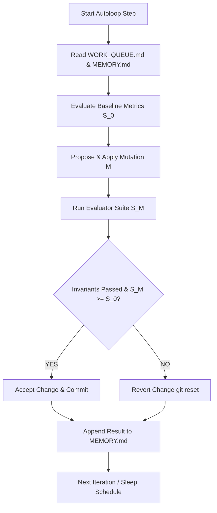

# GitHub Next Autoloop Program: Operation Kingfisher

**Project:** Operation Kingfisher  
**Paradigm:** GitHub Next Autonomous Loop Engineering  
**Version:** 1.0.0  
**Discipline Standard:** D6 Compliance (`kfcheck.certify ok=true`)

---

## 1. Objective & Mission Goal

Automate the continuous, iterative development, verification, and empirical optimization of **Operation Kingfisher** — a trustless, decentralized hypergraph AI computer running verified MeTTa symbolic reductions across consumer edge devices.

The Autoloop continuously iterates over:
1. **Graph AI Rule Induction (G-Series):** Maximize Filtered Mean Reciprocal Rank (MRR) and Hits@10 on the FB15k-237 knowledge graph benchmark without degrading computational throughput.
2. **Witness Verification Substrate (W-Series & S-Series):** Minimize verification time ($T_{\text{ver}}$) and proof payload size ($|W|$), maintaining an $O(1)$ memory footprint ($\le 128\text{ bytes}$) across sequential epoch chains.
3. **Repository Integrity & Soundness (H-Series):** Maintain 100% clean harness compliance with zero broken references, zero duplicate journal items, and strict D6 empirical provenance.

---

## 2. Permitted Mutation Targets

The autonomous loop is authorized to inspect, evaluate, and mutate:
- `spikes/G*/`: Graph AI rule learning algorithms, hypergraph composition joins, and evaluation scripts.
- `spikes/W*/`: Witness generation, Merkle authenticated tries, and dispute bisection protocols.
- `spikes/S*/`: Empirical benchmarks, crossover models, and profiling harnesses.
- `specs/`: Formal specifications and protocol definitions.
- `WORK_QUEUE.md` & `HANDOFF.md`: Queue progression and write-ahead journaling.
- `.github/autoloop/MEMORY.md`: Autonomous iteration memory, Pareto frontiers, and lessons learned.

---

## 3. Evaluation Commands & Metrics

Each candidate mutation is evaluated through a composite, deterministic metric suite:

| Dimension | Evaluator Command | Metric Key | Target Threshold |
|---|---|---|---|
| **Harness Hygiene** | `python3 .github/autoloop/evaluators/eval_hygiene.py` | `hygiene_score` | $= 1.00$ (Zero errors) |
| **Graph AI MRR** | `python3 .github/autoloop/evaluators/eval_graph_ai.py` | `filtered_mrr` | $\ge 0.2500$ (Current: $0.2648$) |
| **Graph AI Hits@10** | `python3 .github/autoloop/evaluators/eval_graph_ai.py` | `hits_at_10` | $\ge 0.3500$ (Current: $0.3929$) |
| **Witness Bandwidth** | `python3 .github/autoloop/evaluators/eval_verification.py` | `bandwidth_savings_pct` | $\ge 70.0\%$ (Current: $75.37\%$) |
| **Verifier Memory** | `python3 .github/autoloop/evaluators/eval_verification.py` | `verifier_ram_bytes` | $\le 128\text{ B}$ (Current: $72\text{ B}$) |

---

## 4. Acceptance & Rollback Invariants

A candidate mutation $M$ is **ACCEPTED** and committed if and only if:
1. **Safety Invariant:** `hygiene_score == 1.00` (All `refcheck.py` and `journalcheck.py` checks pass cleanly).
2. **D6 Standard:** Any modified spike generates a valid `provenance.json` with `ok == true`, passing all pre-registered controls and falsifiers.
3. **No Retraction Regressions:** The change does not violate active scopes in `out/RETRACTIONS.md`.
4. **Pareto Dominance:** The composite score $S(M) \ge S(\text{baseline})$ across targeted metrics without catastrophic degradation ($>5\%$) in any non-targeted dimension.

If any invariant fails, the mutation is **REJECTED**, working state is reverted (`git checkout`), and failure diagnosis is recorded in `.github/autoloop/MEMORY.md`.

---

## 5. Execution Workflow

